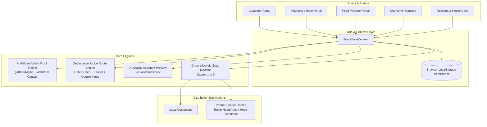
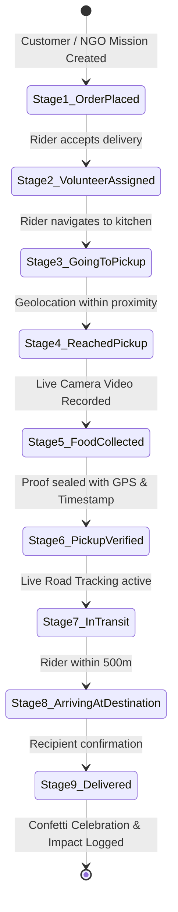
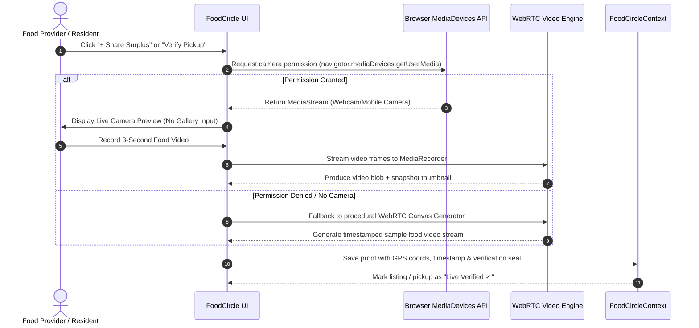

# FoodCircle System Architecture

This document provides a detailed technical overview of the architecture, data models, state machines, and verification pipelines implemented in **FoodCircle**.

---

## 🏛️ High-Level System Architecture

---

## 🔄 Order Lifecycle State Machine

Every order moves through a strict 9-stage sequence with enforced verification checkpoints:

### Stage Details

| Code | Stage Name | Description | Enforced Action / Checkpoint |
| ---- | ---------- | ----------- | ---------------------------- |
| **1** | `Order Placed` | Customer places order or household lists NGO donation. | Order ID generated (`#FC10245`). |
| **2** | `Volunteer Assigned` | Volunteer reviews pickup address, distance, and accepts. | Assigned volunteer ID mapped to order. |
| **3** | `Volunteer Going to Pickup` | Rider starts transit toward provider or resident kitchen. | Route calculated; ETA displayed to customer. |
| **4** | `Volunteer Reached Pickup Location` | Rider physically arrives at the pickup address. | Location verified via browser Geolocation. |
| **5** | `Food Collected` | Food handed over to rider. | **Locked:** Cannot collect without recording proof. |
| **6** | `Pickup Verified` | Live 3-second video recorded and location coordinates stamped. | Proof watermark generated; viewable by customer & admin. |
| **7** | `Food in Transit` | Rider journeys toward customer address or NGO shelter. | Real-time map rider movement and Google Maps route link. |
| **8** | `Arriving at Destination` | Rider reaches destination perimeter. | Final delivery reminder sent. |
| **9** | `Delivered` | Recipient accepts package. | Confetti celebration modal & environmental impact counter updated. |

---

## 🛡️ Anti-Scam Live Video Verification Pipeline

---

## 🗺️ Live Delivery Tracking & Google Maps Architecture

The tracking subsystem combines two complementary approaches:
1. **Interactive In-App Road Route Map:**
   * Utilizes Leaflet coordinates across Kolkata metropolitan checkpoints (Salt Lake Sector V, Park Street, New Town, Gariahat).
   * Renders pulsating origin (pickup), destination (customer/shelter), and dynamic rider vehicle marker with animated SVG paths.
2. **Direct Google Maps Deep Link:**
   * Generates dynamic routing URLs:
     `https://www.google.com/maps/dir/?api=1&origin={lat},{lng}&destination={destLat},{destLng}&travelmode=two_wheeler`
   * Gives riders and customers real-time turn-by-turn navigation in native Google Maps with a single click.

---

## 📂 Source Code Structure

* `src/context/FoodCircleContext.jsx`: Single source of truth managing users, listings, cart, orders, and modal visibility states.
* `src/components/customer/CustomerListSurplusModal.jsx`: Full-screen dialog with direct camera integration for resident food sharing and NGO donation dispatch.
* `src/components/volunteer/PickupVerificationModal.jsx`: Rider pickup verification requiring live camera proof before status advancement.
* `src/components/common/LiveTrackingMap.jsx`: Dual-mode live route tracking (visual map canvas + external Google Maps routing).
* `src/utils/videoProofGenerator.js`: Procedural canvas video synthesizer ensuring testability on development machines lacking hardware webcams.
